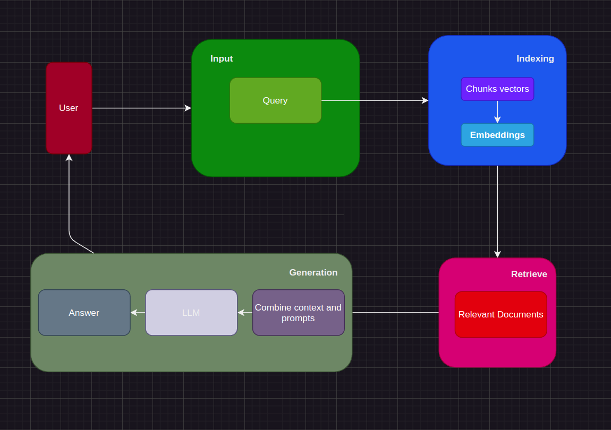

# Retrieval Pipeline Design

## Table of contents
- Introduction
- Prerequires
- Installation and Inference
- How to use 
- Testing with hallucination
- TODO

## INTRODUCTION
The system is designed to run locally with a focus on practicality, cost-efficiency, and speed. It effectively preprocesses data from various formats, including PDFs, Excel files, and images, ensuring a streamlined workflow. A key feature of the system is its ability to detect hallucinations or insufficient context in outputs generated by large language models (LLMs), enhancing the reliability of the results.

To achieve this, the system incorporates several powerful tools:

Faiss: Chosen for its ability to perform fast and lightweight similarity searches, Faiss excels in handling large-scale data efficiently. This ensures that the system can quickly retrieve relevant information, making it both practical and high-performing.

Moondream LLM: Stands out for its impressive cost-efficiency and speed. Designed to operate seamlessly on a variety of devices, even those with limited resources, it offers a budget-friendly solution for businesses and individuals alike. The model's efficiency is particularly advantageous for applications requiring real-time responses, making it a valuable asset in fast-paced environments. Moreover, Moondream LLM's ability to process information rapidly contributes to its overall productivity and user satisfaction

Nomic-embed-text:  Is renowned for its efficiency in terms of both cost and speed. Designed to generate high-quality embeddings rapidly, even for extensive text, it offers a cost-effective solution for NLP tasks. This tool is optimized to minimize computational resources, making it ideal for applications that require real-time processing. Its ability to quickly produce accurate embeddings contributes significantly to its overall productivity and user satisfaction.

Transformer "openai/clip-vit-base-patch32": This model is a versatile tool for vision-language tasks, making it ideal for processing image data and aligning it with textual information. Its efficiency and accuracy contribute to the system's overall speed and reliability.

By running the system locally on a GPU RTX 3060 with 16GB RAM, it maintains a high level of performance while significantly reducing operational costs. This setup ensures that the system remains both practical and cost-efficient, delivering results rapidly without the need for expensive cloud resources.

## PREREQUIRES
- Ubuntu 18.04
- Python 3.8.10
- Transformers
- Langchain
- Nvidia docker
- Docker compose


## INSTALLATION AND INFERENCE
- Install nvidia-docker
```
curl -fsSL https://nvidia.github.io/libnvidia-container/gpgkey \
    | sudo gpg --dearmor -o /usr/share/keyrings/nvidia-container-toolkit-keyring.gpg
curl -s -L https://nvidia.github.io/libnvidia-container/stable/deb/nvidia-container-toolkit.list \
    | sed 's#deb https://#deb [signed-by=/usr/share/keyrings/nvidia-container-toolkit-keyring.gpg] https://#g' \
    | sudo tee /etc/apt/sources.list.d/nvidia-container-toolkit.list
sudo apt-get update
sudo apt-get install -y nvidia-container-toolkit
sudo nvidia-ctk runtime configure --runtime=docker
sudo systemctl restart docker
```

- Create Ollama serving
```
sudo docker-compose up -d
```

- Install client docker
```
docker pull nvcr.io/nvidia/pytorch:24.03-py3
nvidia-docker run -it -d --privileged --net=host --name rag_pipeline -v /path/to/code:/develop -w /develop nvcr.io/nvidia/pytorch:24.03-py3
sudo docker exec -it rag_pipeline bash
cd /develop
python3 run.py
```

## HOW TO USE
- To create new index: uncommnet lines 123-124 in run.py 
- To retrieve with image: comment line 120, 121, the uncomment line 122 
- To retrieve with documentation: comment line 120, 122, the uncomment line 121 
- To detect hallucination: comment lines 121, 122, the uncomment line 120

## Benchmark
- For image retrieve
```
Time to embedding for single image: 0.071s
Time to search for single image: 4.697-05s
```
- For document retrieve
```
Time to retrieve a query string: 0.244s
```

## Testing with hallucination
```
python3 tools/test_hallucination.py

response = "รัดย่องมีการที่สมินวัด"
context = 'A. Phí khởi tạo dịch vụ và đào tạo\n\n\n\n\n\n\n\n\n\n\n\n1\nPhí khởi tạo hệ thống\nDịch vụ\n2000000\n1\n2000000\n\n0\n2000000\nPhí khởi tạo dịch vụ bao gồm: phí cấu hình hệ thống và phí khởi tạo dữ liệu ban đầu Thanh toán một lần duy nhất Buổi\n1000000\n3\n3000000\n0.666667\n2000000\n1000000\nChi phí đào tạo triển khai tính theo số lớp khách hàng đăng ký đào tạo: 1.000.000 đồng / 01 buổi áp dụng cho đào tạo trực tiếp khu vực Hà Nội và Thành phố Hồ Chí Minh và trực tuyến ở tất cả các tỉnh/thành phố / 1 năm\\n- Dịch vụ hỗ trợ trực tuyến trong suốt thời gian vận hành miễn phí\\n- Thời gian đăng ký sử dụng tối thiểu 12 tháng. Thanh toán phí sử dụng 1 lần vào đầu kỳ thanh toán. 15\n\nCảnh báo khối lượng thực tế vượt khối lượng kế hoạch bằng text màu đỏ cả dòng công việc\n\n\n16\nHợp đồng giao thầu\nQuản lý chi tiết thông tin hợp đồng ký với thầu phụ: GTHĐ,phụ lục đính kèm, và bảng khối lượng thi công từng hạng mục(BOQ) ký với thầu phụ'

{'is_hallucination': True, 'similarity_score': 0.5371037183400404, 'common_words': []}
```


## TODO
- [ ] Combine both vector and word queries
- [ ] Reply with llm when no retrieve results found
- [ ] Add process multi-language support
- [ ] Add preprocessing on the input documents (Remove duplicate,...)